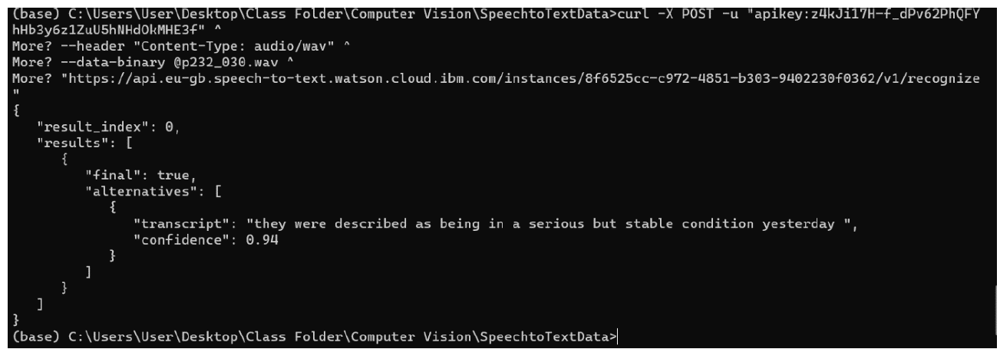
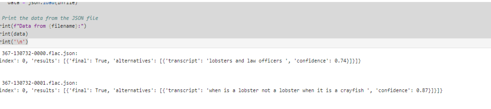

# IBM Watson Speech to Text Project

## Overview
This project demonstrates the implementation of IBM Watson's Speech to Text service to convert spoken language into text. Utilizing Python, this repository guides users through setting up IBM Watson, processing audio files, and evaluating the performance of speech recognition.

## Features
- **API Setup**: Instructions on setting up the IBM Watson Speech to Text service.
- **Audio Processing**: Scripts to process audio files and convert speech to text.
- **Performance Analysis**: Evaluation of transcription accuracy across various datasets.

## Getting Started

### Prerequisites
Ensure you have Python installed on your machine. You will also need an IBM Cloud account and the following Python packages:


### Installation
Clone this repository to your local machine:
```bash
git clone https://github.com/yourusername/ibm-watson-speech-to-text.git
```
Install the required Python packages:

```bash
pip install -r requirements.txt
```
Usage
To start using the Speech to Text scripts, navigate to the src directory and run:
```bash
python speech_to_text_api.py
```

### Screenshots

Here is a preview of the speech recognition output:



